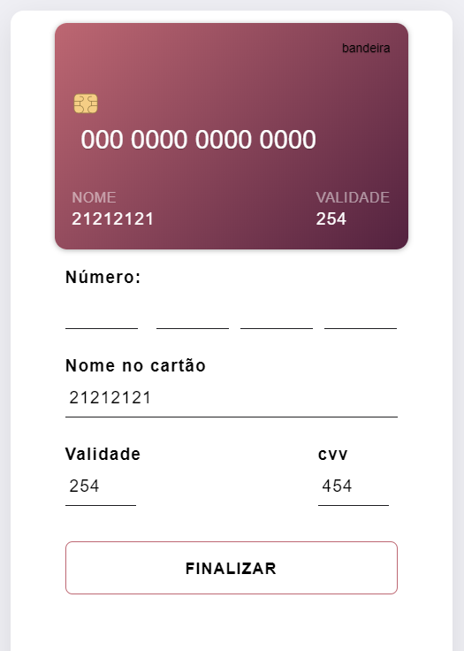

# Checkout

Página de checkout para capturar dados do pagamento de forma interativa;

## Objetivo

Criar uma página de captura de dados de cartão de forma intuitiva.

## Considerações

- para melhorar o projeto, precisa encontrar um regex de verificação de bandeiras de cartões e icones estilizados para as bandeiras;

## Authors

- **Guilherme Soares** - _CriaçãodaPaginaCheckout_ - [guilhermesteve](https://github.com/guilhermesteve)
